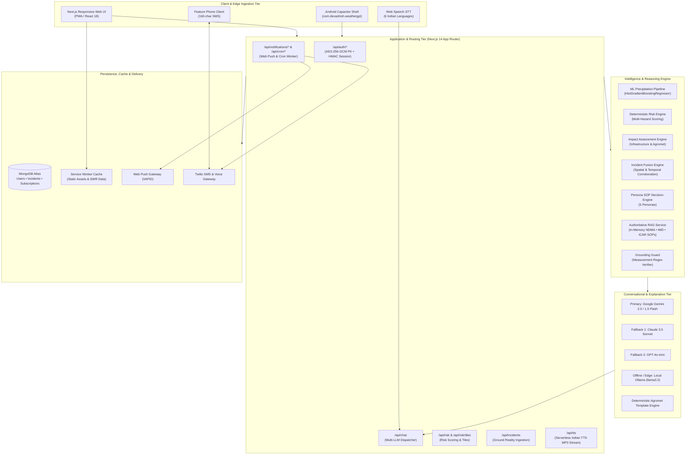

<div align="center">


<br/>

<a href="https://temp-gpt-ten.vercel.app/">
  
</a>

<br/><br/>


<br/><br/>

<p>
  <a href="#-overview"><b>Overview</b></a> •
  <a href="#-the-core-pipeline"><b>Core Pipeline</b></a> •
  <a href="#-system-architecture"><b>Architecture</b></a> •
  <a href="#-key-features"><b>Features</b></a> •
  <a href="#-persona-matrix"><b>Persona Matrix</b></a> •
  <a href="#-languages"><b>Languages</b></a> •
  <a href="#-getting-started"><b>Getting Started</b></a> •
  <a href="docs/TECHNICAL_APPROACH.md"><b>Master Technical Document</b></a>
</p>

</div>


---

## 🌟 Overview

**WeatherGPT** is a hyper-local, conversational weather intelligence and disaster management platform built for **Smart India Hackathon 2026 (Problem Statement ID: 26068)** by **Team SIHnergy**.

Traditional weather apps display raw numbers and meteorological charts (*"38 mm rain, 92% humidity"*). WeatherGPT closes the **cognitive translation gap** by transforming forecasts into **role-specific risk intelligence, physical impact assessments, and actionable operational directives** across **6 native Indian languages** with two-way voice interaction (STT & TTS), interactive geospatial risk maps, offline PWA resilience, and last-mile SMS/voice delivery.

> ### 🛡️ Safety Core Architecture:
> $$\mathbf{ML\ PREDICTS\ \ \bullet\ \ RULES\ DECIDE\ \ \bullet\ \ LLM\ EXPLAINS}$$
> * **ML Models** forecast continuous atmospheric variables (e.g., $t+1$ precipitation intensity).
> * **Deterministic Rule Engines** evaluate audited safety thresholds & standard operating procedures (NDMA / IMD / ICAR).
> * **Generative LLMs** explain structured decisions in natural native Indian scripts without hallucinating numerical values or overriding safety protocols.

---

## 🔄 The Core Pipeline

$$\text{FORECAST} \longrightarrow \text{RISK} \longrightarrow \text{IMPACT} \longrightarrow \text{GROUND REALITY} \longrightarrow \text{DECISION} \longrightarrow \text{ACTION} \longrightarrow \text{ALERT}$$


---

## 🏗️ System Architecture



---

## ✨ Key Features

<table>
<tr>
<td width="50%" valign="top">

### 📍 4-Tier Zero-Config Geocoding
1. **BigDataCloud Client Geolocation API** (Sub-locality precision)
2. **OpenStreetMap Nominatim Engine**
3. **Google Maps Geocoding API**
4. **Haversine Distance Matcher** across 100+ Indian cities

</td>
<td width="50%" valign="top">

### ⚠️ Multi-Hazard Risk Scoring
Deterministic mathematical scoring ($0.0$ to $1.0$):
* **Flood Risk:** $24\text{h Rain } (62\%) + \text{Probability } (28\%) + \text{Humidity } (10\%)$
* **Heatwave Risk:** Excess apparent temperature $>32^\circ\text{C } (75\%) + \text{Humidity } (25\%)$
* **Wind & Storm Risk:** Sustained speed & gust probability

</td>
</tr>
<tr>
<td width="50%" valign="top">

### 🎙️ Full-Fidelity Voice STT & TTS
* **Speech-to-Text:** Live pulsing microphone input in 6 Indian languages.
* **Serverless TTS Streaming (`/api/tts`):**
  * Auto-expands meteorological symbols (`২৯°C` $\rightarrow$ *২৯ ডিগ্রি সেলসিয়াস*)
  * 150-character sub-chunk concatenation for zero playback stutter

</td>
<td width="50%" valign="top">

### 🛡️ Grounding Guard & Authoritative RAG
* **In-Memory RAG:** Instant retrieval of NDMA, IMD, and ICAR disaster protocols without vector DB latency.
* **Grounding Guard (`groundingGuard.js`):** Regex verifier that cross-checks all numeric claims ($^\circ\text{C}$, $\text{mm}$, $\text{km/h}$) against backend data to prevent AI hallucinations.

</td>
</tr>
<tr>
<td width="50%" valign="top">

### 🗺️ Geospatial Risk & Impact Map
* Interactive Leaflet map with multi-hazard heatmap layer.
* 24-hour interactive timeline scrubber.
* Corroborated incident markers (roadblocks, waterlogging, landslides) with distance badges.

</td>
<td width="50%" valign="top">

### 📶 Offline PWA & Local AI
* **Service Worker (`public/sw.js`):** Stale-While-Revalidate caching keeps risk data accessible offline.
* **Local Ollama Integration (`llama3.2`):** Air-gapped / local edge LLM support with deterministic rule fallbacks.

</td>
</tr>
</table>

---

## 👥 Persona Matrix

WeatherGPT dynamically adjusts its focal parameters and standard operating procedures based on the user's role:

| Persona | Focal Meteorological Parameters | Projected Physical Impact | Prescribed Actionable Directive |
| :--- | :--- | :--- | :--- |
| 🌾 **Farmer** | Soil moisture saturation, rainfall rate, wind speed | Crop root anoxia, fertilizer wash-off | *"Drain field runoff immediately. Postpone pesticide sprays and urea top-dressing for 48 hours."* |
| 🎣 **Fisherman** | Coastal wind velocity (knots), wave height, squalls | Sea roughness, capsizing danger | *"Halt near-shore and deep-sea craft departures. Secure coastal gear and mooring lines."* |
| 🚚 **Logistics** | Visibility, road waterlogging, underpass clearance | Route delays, freight moisture damage | *"Reroute transit away from low-elevation ring underpasses. Halt freight where water exceeds 25 cm."* |
| 🏗️ **Construction** | Gust speed, precipitation accumulation, trench status | Excavation collapse, scaffolding risk | *"Halt deep trench excavation. Suspend scaffolding work; dewater foundation sumps."* |
| 👤 **Citizen** | Commute safety, localized drainage, rain onset | Underpass submersion, traffic gridlock | *"Avoid low-lying underpasses. Work remotely if possible; keep emergency supplies."* |
| 🏛️ **Authority** | Inundation index, drainage basin load, incident count | Municipal pump overflow, chokepoints | *"Pre-position diesel dewatering pumps at vulnerable culverts. Issue traffic diversions."* |

---

## 🇮🇳 Supported Languages

<div align="center">

| Language | Native Script | Voice STT | Native Audio TTS |
| :---: | :---: | :---: | :---: |
| **Hindi** | हिंदी | ✅ | ✅ |
| **Bengali** | বাংলা | ✅ | ✅ |
| **Tamil** | தமிழ் | ✅ | ✅ |
| **Telugu** | తెలుగు | ✅ | ✅ |
| **Marathi** | मराठी | ✅ | ✅ |
| **English** | English (IN/Global) | ✅ | ✅ |

</div>

---

## 🧠 Machine Learning Precipitation Pipeline

* **Algorithm:** `HistGradientBoostingRegressor` (Scikit-Learn)
* **Training Dataset:** 210,376 hourly records (2022–2024) across 8 Indian metropolises (Mumbai, Delhi, Pune, Chennai, Kolkata, Bengaluru, Hyderabad, Ahmedabad).
* **Target:** Next-hour precipitation quantity ($t+1\text{ hour}$).
* **Model Artifacts:** `ml/models/precipitation_model.joblib` & `ml/models/precipitation_model_metadata.json`.

| Metric | Persistence Baseline | WeatherGPT ML Model |
| :--- | :---: | :---: |
| **Mean Absolute Error (MAE)** | $0.230\text{ mm}$ | **$0.229\text{ mm}$** |
| **Root Mean Squared Error (RMSE)** | $0.953\text{ mm}$ | **$0.801\text{ mm}$** |
| **Explained Variance ($R^2$)** | $0.150$ | **$0.400$ ($2.67\times$ gain)** |
| **Rain Detection Recall** | $71.9\%$ | **$91.7\%$** |
| **Rain Detection ROC-AUC** | $0.897$ | **$0.935$** |

---

## 🔒 Security, Privacy & Data Protection

* **Application-Level PII Encryption (`src/lib/privateData.js`):** User phone numbers, names, and emails are encrypted at rest using **AES-256-GCM** with 12-byte initialization vectors and auth tags.
* **Blind Indexing:** Searchable HMAC-SHA256 hashes allow duplicate phone/email detection without storing unencrypted PII in database indexes.
* **Session Management:** Signed HMAC-SHA256 session tokens stored in `HttpOnly`, `Secure`, `SameSite=Lax` cookies (`weathergpt_session`).
* **Server-Side API Key Isolation:** All AI and provider keys are strictly isolated in server-side environment variables.

---

## 🚀 Getting Started

### 1. Clone the Repository
```bash
git clone https://github.com/Prem7105/weathergpt.git
cd weathergpt
```

### 2. Install Dependencies
```bash
npm install
```

### 3. Configure Environment Variables
Copy `.env.example` to `.env.local`:
```bash
cp .env.example .env.local
```

Configure your environment keys:
```env
# Database & Authentication (Required for user accounts & sessions)
MONGODB_URI=mongodb+srv://...
AUTH_SESSION_SECRET=your_long_random_session_signing_secret
AUTH_DATA_ENCRYPTION_KEY=your_32_byte_base64_encryption_key

# Primary LLM Engine
GEMINI_API_KEY=your_gemini_api_key

# Optional Cloud LLM Fallbacks
CLAUDE_API_KEY=your_claude_api_key
OPENAI_API_KEY=your_openai_api_key

# Weather & Geocoding (Google is optional; auto-fails over to Open-Meteo)
GOOGLE_API_KEY=your_google_maps_key
OPENWEATHERMAP_API_KEY=your_radar_tiles_key

# Last-Mile Delivery (Twilio for SMS/Voice OTP & Web Push)
TWILIO_ACCOUNT_SID=your_twilio_sid
TWILIO_AUTH_TOKEN=your_twilio_auth_token
TWILIO_VERIFY_SERVICE_SID=your_verify_sid
TWILIO_PHONE_NUMBER=your_twilio_phone_number
VAPID_PUBLIC_KEY=your_vapid_public_key
VAPID_PRIVATE_KEY=your_vapid_private_key
CRON_SECRET=your_cron_authorization_secret
```

### 4. Run Core Pipeline Tests
```bash
npm run test:core
```

### 5. Start Development Server
```bash
npm run dev
```
Open [http://localhost:3000](http://localhost:3000) in your browser.

### 6. Build for Production
```bash
npm run build
npm start
```

---

## 📖 In-Depth Technical Documentation

For the complete 33-section engineering document covering mathematical risk formulations, grounding guard traces, RAG architecture, SIH golden demonstration paths, and the 20-question jury defense guide, see:

👉 **[Master Technical Approach Document (`docs/TECHNICAL_APPROACH.md`)](docs/TECHNICAL_APPROACH.md)**

---

<div align="center">

### 💬 Built with ❤️ for Smart India Hackathon 2026
**Team SIHnergy • Problem Statement ID: 26068 (Disaster Management)**


</div>
