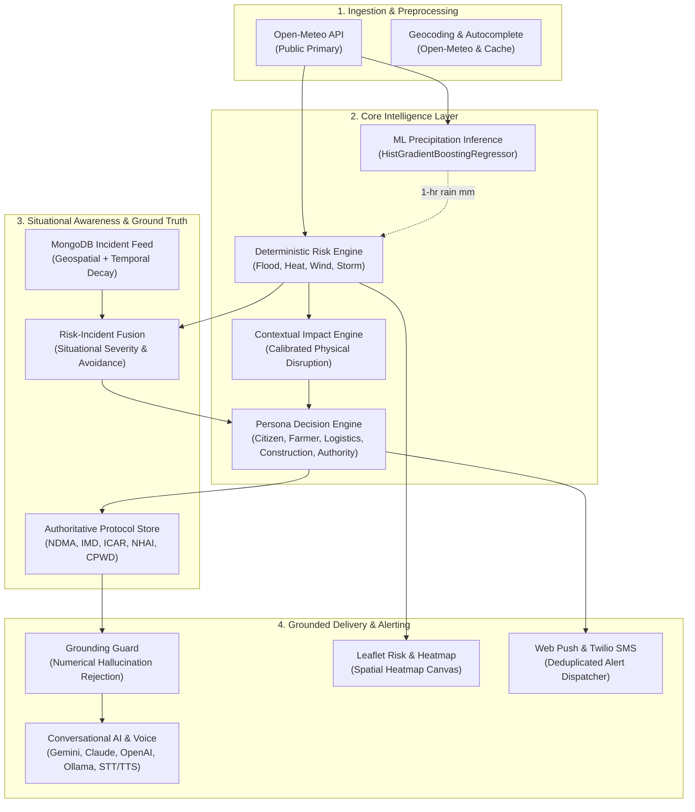

# WeatherGPT System Architecture

## 1. Architectural Principles

WeatherGPT is designed around three non-negotiable architectural tenets:
1. **ML Predicts Continuous Atmospheric Variables**: Machine learning models forecast physical values (e.g. $t+1$ hour rainfall amount in mm) rather than arbitrary risk scores.
2. **Deterministic Rules Make Decisions**: Transparent, audited mathematical rule engines evaluate safety thresholds and official standard operating procedures (NDMA, IMD, ICAR).
3. **Generative AI Explains**: LLMs personalize, summarize, and translate structured meteorological decisions in native Indian languages without calculating or fabricating numbers.

```
WEATHER ➔ RISK ➔ IMPACT ➔ GROUND REALITY ➔ DECISION ➔ ACTION ➔ ALERT
```

---

## 2. Core Subsystems



---

## 3. Data Contracts & Isolation

- **WeatherSnapshot**: Standardized current weather telemetry.
- **RiskAssessment**: Hazard type, score (0.000 to 1.000), severity level (`low`, `moderate`, `high`, `severe`), factors/drivers, timeline, and peak risk.
- **ImpactAssessment**: Hazard-specific physical impact points (road inundation, crop damage, crane limits, high-sided rollover risks).
- **GroundRealityIncident**: Verified community/official incidents decaying after 6 hours.
- **PersonaDecision**: Role-tailored action directives (`recommendations`, `avoid`, `monitor`, `escalation`).
- **GroundingGuard Result**: Boolean validity checking AI text against structured context numbers with strict unit normalization.
