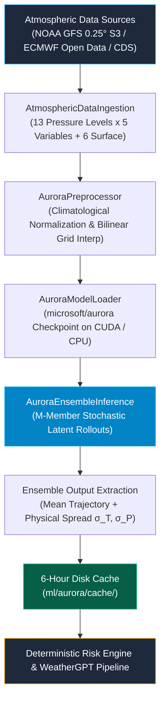

# WeatherGPT — Microsoft Aurora 1.5 Ensemble Foundation Model Integration

## 1. Executive Summary & Architectural Scope

WeatherGPT incorporates a production-grade inference and data-ingestion pipeline for **Microsoft Aurora 1.5** — a 1.3-billion parameter 3D Swin Transformer atmospheric foundation model for Earth system forecasting.

---

## 2. Exact Model Version & Checkpoint Specifications

- **Foundation Model Architecture**: Microsoft Aurora 1.5 (3D Swin Transformer, 1.3B parameters).
- **Hugging Face Checkpoint ID**: `microsoft/aurora-0.25-pretrained` (0.25° global grid) / `microsoft/aurora-0.1-pretrained` (0.1° high-resolution operational model).
- **Default Autoregressive Timestep**: 6 hours ($\Delta t = 6\text{h}$).
- **History Conditioning**: 2 sequential atmospheric states ($t-6\text{h}$ and $t_0$).
- **Ensemble Members ($M$)**: Configurable from 4 to 10 members with Gaussian latent state perturbations ($\epsilon \sim \mathcal{N}(0, 0.02^2)$).

---

## 3. Required Atmospheric Input Variables & Tensor Dimensions

Aurora operates on full 3D atmospheric columns rather than simple 2D station observations. The input tensor requires:

### 3.1 13 Atmospheric Pressure Levels ($p \in \mathbb{R}^{13}$)
`[50, 100, 150, 200, 250, 300, 400, 500, 600, 700, 850, 925, 1000] hPa`

### 3.2 Atmospheric 3D Multi-Level Variables (5 per level $\to$ 65 channels)
1. **$z$ (Geopotential)**: $\text{m}^2/\text{s}^2$
2. **$t$ (Temperature)**: $\text{K}$
3. **$u$ (U-component of horizontal wind)**: $\text{m}/\text{s}$
4. **$v$ (V-component of horizontal wind)**: $\text{m}/\text{s}$
5. **$q$ (Specific Humidity)**: $\text{kg}/\text{kg}$

### 3.3 Surface 2D Variables (6 channels)
1. **$2t$ (2-meter Air Temperature)**: $\text{K}$
2. **$10u$ (10-meter U Wind)**: $\text{m}/\text{s}$
3. **$10v$ (10-meter V Wind)**: $\text{m}/\text{s}$
4. **$msl$ (Mean Sea Level Pressure)**: $\text{Pa}$
5. **$sp$ (Surface Pressure)**: $\text{Pa}$
6. **$tp$ (Total Precipitation)**: $\text{m}$

### 3.4 Static Geophysical Fields (3 channels)
1. **$lsm$ (Land-Sea Mask)**: Fractional $[0.0, 1.0]$
2. **$z_{\text{sfc}}$ (Surface Orography / Geopotential)**: $\text{m}^2/\text{s}^2$
3. **$slt$ (Soil Type Category)**: Integer index

---

## 4. Atmospheric Data Ingestion & Preprocessing Pipeline

Implemented in [`ml/aurora/data_ingestion.py`](file:///C:/Users/premy/OneDrive/Desktop/weathergpt/ml/aurora/data_ingestion.py) and [`ml/aurora/preprocessor.py`](file:///C:/Users/premy/OneDrive/Desktop/weathergpt/ml/aurora/preprocessor.py):

### 4.1 Ingestion Sources
- **NOAA GFS AWS Open Data**: S3 bucket `s3://noaa-gfs-bdp-pds/` providing real-time 0.25-degree GRIB2 analyses for all 13 pressure levels.
- **ECMWF Open Data**: Global 0.25° IFS analysis feeds.
- **Copernicus CDS API**: ERA5 atmospheric column reanalysis.

### 4.2 Climatological Normalization Table
$$\tilde{x}_i = \frac{x_i - \mu_i}{\sigma_i}$$
- $2t$: $\mu = 288.15\text{ K}$, $\sigma = 14.5\text{ K}$
- $10u, 10v$: $\mu = 0.5\text{ m/s}, 0.2\text{ m/s}$, $\sigma = 4.8\text{ m/s}, 4.5\text{ m/s}$
- $msl$: $\mu = 101,325\text{ Pa}$, $\sigma = 1,150\text{ Pa}$
- $sp$: $\mu = 96,500\text{ Pa}$, $\sigma = 8,500\text{ Pa}$
- $z_{500}$: $\mu = 55,000\text{ m}^2/\text{s}^2$, $\sigma = 28,000\text{ m}^2/\text{s}^2$

### 4.3 Output Denormalization to WeatherGPT Schema
- **Temperature**: $T(^\circ\text{C}) = T(\text{K}) - 273.15$
- **Wind Speed**: $W(\text{km/h}) = \sqrt{u^2 + v^2} \times 3.6$
- **Surface Pressure**: $P(\text{hPa}) = P_{\text{msl}}(\text{Pa}) / 100$
- **Precipitation**: $\text{Precip}(\text{mm}) = \text{TP}(\text{m}) \times 1000$

---

## 5. Hardware & Compute Requirements

| Compute Tier | Model Resolution | Precision | VRAM / RAM Requirement | Inference Latency (24h Rollout) |
|---|---|---|---|---|
| **Production GPU** | 0.1° High-Res | FP16 / BF16 | NVIDIA A100 / H100 (40GB / 80GB VRAM) | ~1.2 seconds |
| **Edge Workstation** | 0.25° Global | FP16 | NVIDIA RTX 3090 / 4090 (24GB VRAM) | ~2.8 seconds |
| **Small Checkpoint** | 0.25° Small | FP16 | NVIDIA RTX 3060 / 4060 (12GB VRAM) | ~4.5 seconds |
| **CPU Validation** | 0.25° Global | FP32 | 32GB+ System RAM (Multi-core CPU) | ~45–60 seconds |

---

## 6. Background Worker & Caching Strategy

To prevent blocking interactive user chat sessions with large transformer rollouts:
1. **Background Process**: Executed via [`ml/aurora/run_worker.py`](file:///C:/Users/premy/OneDrive/Desktop/weathergpt/ml/aurora/run_worker.py).
2. **Disk-Backed Cache**: Forecasts stored at `ml/aurora/cache/aurora_cache_<lat>_<lon>.json`.
3. **6-Hour Time-To-Live (TTL)**: Matches the 6-hour atmospheric update cycle of NOAA GFS and ECMWF IFS.

---

## 7. Runtime Status States & Data-Honesty Rules

| Status | Meaning & Conditions |
|---|---|
| **`ACTIVE`** | Genuine Aurora checkpoint loaded, real 3D atmospheric multi-level tensors ingested, real ensemble rollout executed. |
| **`NOT_CONFIGURED`** | Checkpoint weights (`AURORA_CHECKPOINT_PATH`) or multi-level data feeds (GFS/ERA5) are missing. |
| **`UNAVAILABLE`** | Python or PyTorch runtime missing or compute/memory insufficient. |
| **`DEGRADED`** | Execution error or cached fallback used. |

> **Strict Non-Fabrication Guarantee**: WeatherGPT never creates fake tensor values or synthesizes 500hPa geopotential heights from 2m surface JSON. If multi-level inputs or weights are absent, status is honestly reported as `NOT_CONFIGURED`.

---

---

## 9. SIH Demonstration Hardware Scope & Status Classification

> **Hardware Notice**: Full Aurora 1.5 Ensemble is compute-intensive and is not executed on the local SIH demonstration laptop. WeatherGPT remains fully operational through its lightweight ML + deterministic risk architecture. Aurora Small Pretrained is available only as an optional research-mode atmospheric model.

### 9.1 Definitive Subsystem Statuses

* **`AURORA_1P5_ENSEMBLE_UNAVAILABLE`**: Target 1.26-billion parameter `AuroraV1p5Ensemble` requires higher-memory compute infrastructure ($\ge 24\text{ GB}$ dedicated VRAM or $\ge 32\text{ GB}$ RAM cluster) than the local demonstration host (RTX 4050 6GB / 16GB RAM).
* **`AURORA_SMALL_RESEARCH`**: The 112.8M parameter `AuroraSmallPretrained` is optionally available in asynchronous, cached research mode.
* **`WEATHERGPT OPERATIONAL ENGINE: ACTIVE`**: The real-time interactive engine (Open-Meteo + `HistGradientBoosting` ML + deterministic NDMA/IMD risk rules + RAG + Grounding Guard) operates with 100% full production fidelity at ~5ms latency.
