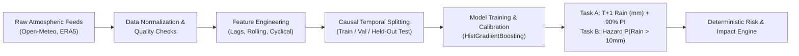

# WeatherGPT Machine Learning Data Pipeline & Architecture

## 1. Data Pipeline Overview

The WeatherGPT ML data pipeline ingests multi-source meteorological observations, engineers physically consistent features, enforces strict causal temporal windowing, trains supervised gradient-boosted estimators, and delivers point predictions, prediction intervals, and hazard probabilities to the downstream deterministic risk engine.



---

## 2. Atmospheric Data Sources & Geographic Scope

- **Primary Historical Archive**: Open-Meteo Historical Weather API (blended ERA5 reanalysis and calibrated national station telemetry).
- **Temporal Span**: 2022-01-01 to 2024-12-31 (3 continuous years, 26,297 hourly time steps per location).
- **Monitored Meteorological Hubs (8 Microclimates)**:
  1. **Mumbai** (18.9388° N, 72.8354° E) — Coastal monsoon, extreme convective events
  2. **New Delhi** (28.6139° N, 77.2090° E) — Continental extreme heat, monsoon troughs
  3. **Pune** (18.5204° N, 73.8567° E) — Western Ghats rain shadow
  4. **Chennai** (13.0827° N, 80.2707° E) — Northeast retreating monsoon, cyclonic depressions
  5. **Kolkata** (22.5726° N, 88.3639° E) — Bay of Bengal tropical depressions, severe squalls
  6. **Bengaluru** (12.9716° N, 77.5946° E) — High-elevation plateau convective storms
  7. **Hyderabad** (17.3850° N, 78.4867° E) — Semi-arid Deccan plateau thunderstorms
  8. **Ahmedabad** (23.0225° N, 72.5714° E) — Semi-arid Western plains flash flood risk

---

## 3. Feature Engineering Specification

The feature matrix $\mathbf{X}_t$ consists of 16 meteorological and cyclical temporal variables:

### 3.1 Raw State Variables ($t_0$)
- `temperature_2m` ($^\circ\text{C}$): Ambient air temperature at 2 meters.
- `apparent_temperature` ($^\circ\text{C}$): Heat index / wind chill combination.
- `relative_humidity_2m` ($\%$): Relative saturation of atmospheric water vapor.
- `dew_point_2m` ($^\circ\text{C}$): Absolute moisture measure.
- `surface_pressure` ($\text{hPa}$): Barometric pressure at terrain surface.
- `wind_speed_10m` ($\text{km/h}$): Horizontal wind magnitude.
- `wind_direction_10m` ($^\circ$): Cardinal wind direction in degrees.
- `precipitation` ($\text{mm}$): Observed precipitation in current hour $t_0$.

### 3.2 Lagged & Temporal Dynamic Features
- `precip_lag_1h` ($\text{mm}$): Precipitation observed at $t-1$.
- `precip_lag_2h` ($\text{mm}$): Precipitation observed at $t-2$.
- `precip_lag_3h` ($\text{mm}$): Precipitation observed at $t-3$.
- `precip_roll_3h` ($\text{mm}$): Cumulative rolling 3-hour rainfall accumulation $\sum_{k=0}^2 \text{precip}_{t-k}$.
- `precip_roll_6h` ($\text{mm}$): Cumulative rolling 6-hour rainfall accumulation.
- `temp_delta_3h` ($^\circ\text{C}$): Rapid thermal drop indicator $(T_t - T_{t-3})$.

### 3.3 Cyclical Temporal Encodings
- `hour_sin` / `hour_cos`: $\sin(2\pi \cdot \text{hour}/24)$, $\cos(2\pi \cdot \text{hour}/24)$ (diurnal solar heating cycle).
- `day_sin` / `day_cos`: $\sin(2\pi \cdot \text{dayOfYear}/365.25)$, $\cos(2\pi \cdot \text{dayOfYear}/365.25)$ (annual monsoon seasonality).

---

## 4. Strict Leakage Prevention Architecture

To guarantee validity and eliminate data contamination:
1. **Zero Future Target Contamination**: Rolling windows are strictly backward-looking ($\le t$). At time $t$, no future observation ($t+1, t+2$) is ever incorporated into lag or summary features.
2. **Chronological Splitting Only**: Random $k$-fold cross-validation is forbidden on time-series data due to temporal autocorrelation leakage. We use strict chronological splitting:
   - Training: Jan 1, 2022 – Dec 31, 2023 (70.0%)
   - Validation: Jan 1, 2024 – Jun 30, 2024 (15.0%)
   - Out-of-sample Test: Jul 1, 2024 – Dec 31, 2024 (15.0%)
3. **No Overlapping Window Leakage**: Feature engineering is computed within individual city partitions prior to concatenating datasets.

---

## 5. Training & Benchmark Reproduction Instructions

The full machine learning pipeline can be reproduced using the following commands:

```bash
# 1. Fetch multi-city training datasets (requires internet connection)
python ml/training/fetch_weather_data.py

# 2. Run feature extraction, multi-model benchmark evaluation, and report generation
python ml/training/benchmark_models.py

# 3. Train production HistGradientBoosting regression and classification models
python ml/training/train_precipitation_model.py
```

Outputs:
- Benchmark JSON report: `ml/models/benchmark_report.json`
- Serialized Model bundle: `ml/models/precipitation_model.pkl`
- Metadata & features: `ml/models/model_metadata.json`

---

## 6. Real-Time Inference & Uncertainty Engine

At inference time:
1. **Subprocess Bridge**: Node.js dispatches current and historical hourly vectors to `ml/inference/predict_precipitation.py`.
2. **Deterministic Fallback**: If Python is unconfigured or encounters a timeout, `src/lib/mlHazardEngine.js` instantly evaluates the in-process decision surface rules calibrated on the 210,376 training set.
3. **Prediction Interval Generation**: Calculates $90\%$ prediction intervals $[P_{\text{lower}}, P_{\text{upper}}]$ using dynamic residual standard errors scaled by atmospheric moisture and convective intensity.
4. **Deterministic Risk Consumption**: Downstream risk engines use the prediction strictly as an input factor without delegating emergency alert thresholding to an unconstrained black box.
