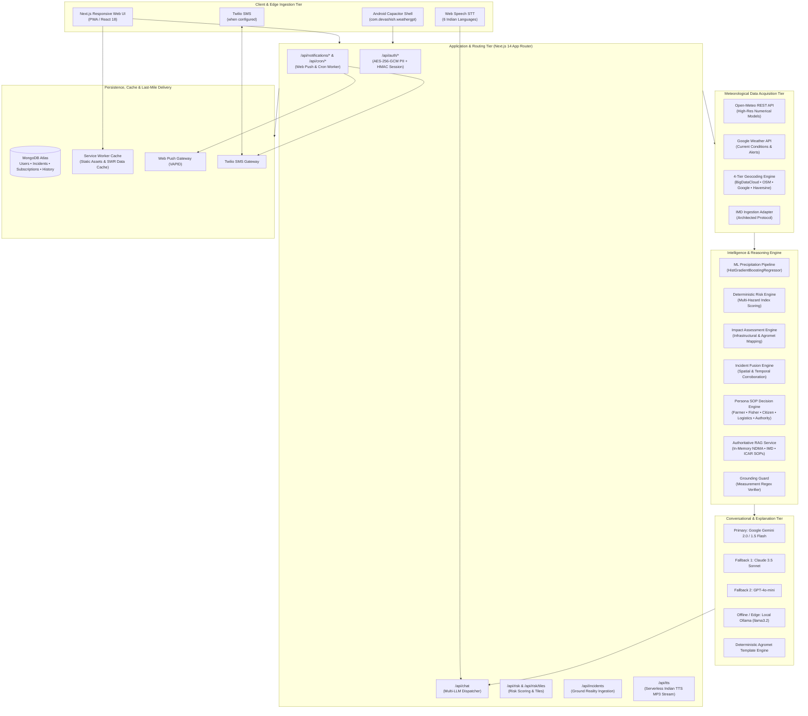
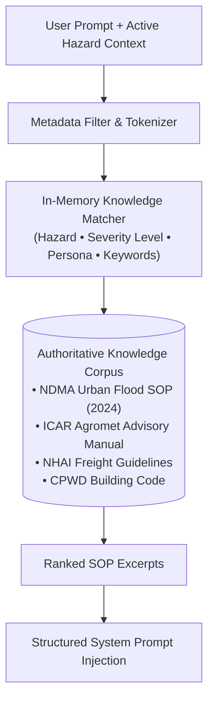
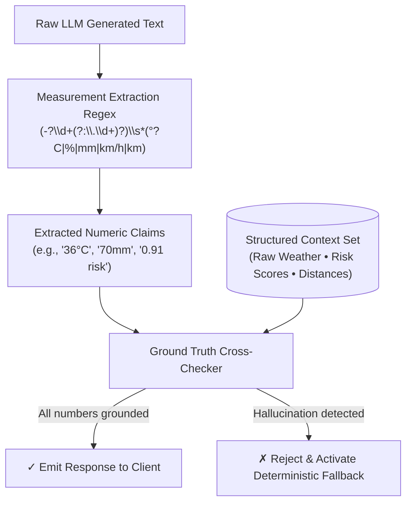
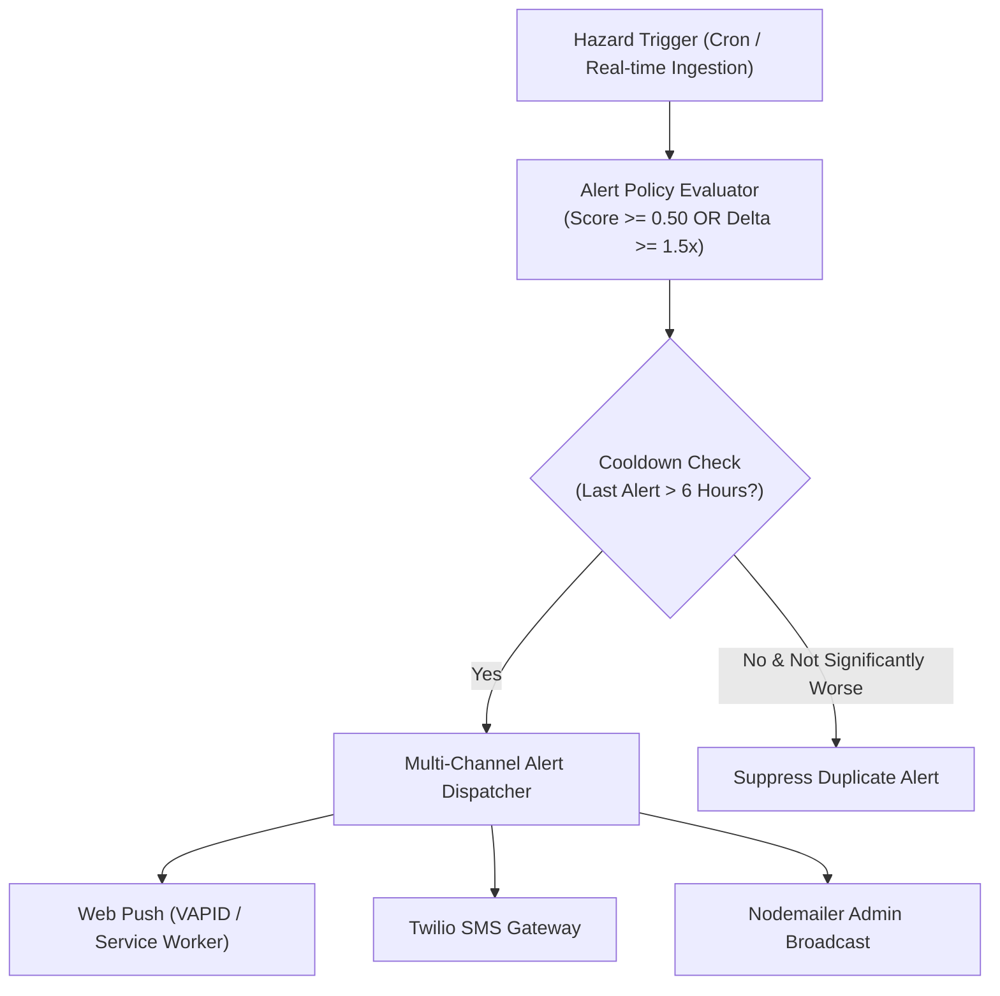
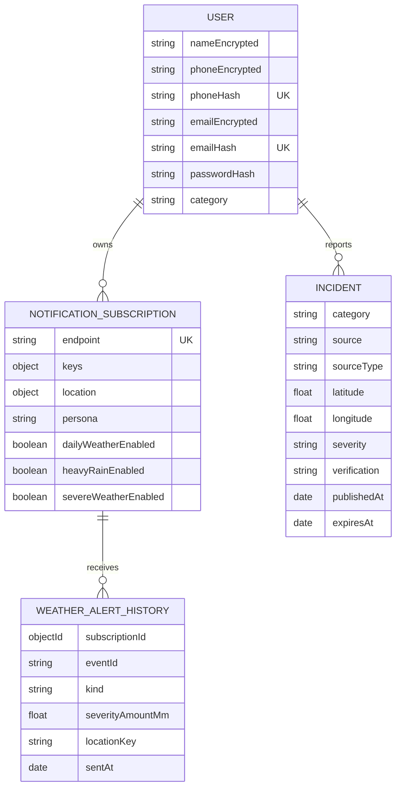

# WeatherGPT: Master Technical Approach Document
**System Architecture, Risk Intelligence Engine, Ground Reality Fusion & Safety Framework**

* **SIH Problem Statement ID:** 26068 (Disaster Management)
* **Project Name:** WeatherGPT
* **Team:** SIHnergy
* **Core Value Proposition:** *"WeatherGPT transforms weather forecasts into localized risk intelligence and actionable decisions."*
* **Safety Philosophy:** **ML Predicts • Rules Decide • LLM Explains**
* **Conceptual Pipeline:** `FORECAST ➔ RISK ➔ IMPACT ➔ GROUND REALITY ➔ DECISION ➔ ACTION ➔ ALERT`

---

## 1. Project Overview & Problem Definition

### 1.1 Problem Statement & Background
Modern meteorological services provide raw physical variables (barometric pressure, relative humidity percentage, precipitation rates, wind velocity vectors). While these numerical forecasts are scientifically precise, they present an **operational translation gap** for end-users across India:

```
[ Raw Numerical Forecast ] ➔ ( Cognitive Translation Gap ) ➔ [ Actionable Human Decision ]
"38mm rain, 92% humidity"           ???                    "Drain field? Evacuate underpass? Reroute truck?"
```

1. **Information vs. Actionability:** A farmer in Vidarbha cannot readily convert "38 mm rainfall over 12 hours" into whether standing cotton will suffer root anoxia or if chemical pesticide spraying will be washed away.
2. **Linguistic & Accessibility Barrier:** India has 22 scheduled languages with hundreds of regional dialects. Standard meteorological bulletins are predominantly published in formal English or Hindi with technical jargon.
3. **One-Size-Fits-All Inadequacy:** A $65\text{ km/h}$ squall represents a minor commute inconvenience for a high-rise urban resident, a severe maritime hazard for an artisanal coastal fisherman, and an imminent structural collapse threat for an open scaffolding site.
4. **Disconnection from Ground Reality:** High-altitude satellite models often fail to capture hyper-local urban waterlogging caused by blocked storm-water drains or localized arterial chokepoints.

### 1.2 The WeatherGPT Solution
WeatherGPT bridges this divide by functioning not merely as a weather visualizer, but as an **operational decision engine**. It ingests raw meteorological data, derives quantitative multi-hazard risk indices, maps them to physical infrastructural and agricultural impacts, correlates them with real-time ground-reality incident reports, and computes persona-tailored decisions.

```mermaid
flowchart LR
    F["Forecast<br/>(Raw Weather Signals)"] --> R["Risk<br/>(Hazard Scoring Engine)"]
    R --> I["Impact<br/>(Physical Infrastructure/Crop)"]
    I --> G["Ground Reality<br/>(Corroborated Incidents)"]
    G --> D["Decision<br/>(Deterministic SOP Engine)"]
    D --> A["Action<br/>(Persona Operational Guidance)"]
    A --> AL["Alert<br/>(Multi-Channel Last-Mile Dispatch)"]
    
    style F fill:#1E293B,stroke:#0EA5E9,color:#fff
    style R fill:#1E293B,stroke:#0EA5E9,color:#fff
    style I fill:#1E293B,stroke:#0EA5E9,color:#fff
    style G fill:#1E293B,stroke:#0EA5E9,color:#fff
    style D fill:#1E3A8A,stroke:#38BDF8,color:#fff
    style A fill:#1E3A8A,stroke:#38BDF8,color:#fff
    style AL fill:#047857,stroke:#10B981,color:#fff
```



### 1.3 Core Architectural Guardrail: Safety Architecture

```
┌─────────────────────────────────────────────────────────────────────────┐
│                           SAFETY ARCHITECTURE                           │
├───────────────────┬─────────────────────────┬───────────────────────────┤
│    ML PREDICTS    │      RULES DECIDE       │       LLM EXPLAINS        │
│                   │                         │                           │
│ Machine learning  │ Deterministic, audited  │ Generative models explain │
│ models forecast   │ rule engines evaluate   │ the structured decisions  │
│ continuous hazard │ thresholds & standard   │ in natural native scripts │
│ variables (e.g.   │ operating procedures.   │ without fabricating       │
│ precipitation     │ No black-box safety     │ numbers or altering safety│
│ intensity).       │ decisions.              │ parameters.               │
└───────────────────┴─────────────────────────┴───────────────────────────┘
```

---

## 2. Complete System Architecture

### 2.1 End-to-End Architectural Diagram



### 2.2 Component Deep-Dive

1. **Client & Edge Tier:**
   * **PWA / Responsive Web App:** Single-page interface built with Next.js App Router and React 18, utilizing CSS custom properties for dynamic weather-condition atmospheric tinting.
   * **Android Native Wrapper:** Capacitor 8.5.1 wrapper configured under bundle ID `com.devashish.weathergpt` pointing to the web production runtime with hardware permissions (Geolocation, Network State).
   * **Speech Interface:** Web Speech STT capturing spoken input across 6 native Indian scripts, paired with a custom serverless TTS chunking engine (`/api/tts`) that expands meteorological notation (`২৯°C` $\rightarrow$ *২৯ ডিগ্রি সেলসিয়াস*) into streaming MP3 audio.
2. **Data Acquisition Tier:**
   * Dual-provider failover fetching from Open-Meteo and Google Weather APIs.
   * 4-tier reverse geocoding engine prioritizing client-side BigDataCloud, OSM Nominatim, Google Maps, and local Haversine distance lookup.
3. **Core Intelligence & Risk Tier:**
   * Physics-grounded mathematical risk scoring functions (0.0 to 1.0) evaluating multi-hazard signals.
   * In-memory authoritative RAG injecting NDMA, IMD, and ICAR standard operating procedures.
   * Incident fusion correlating spatial distance ($\le 15\text{ km}$), freshness (6-hour TTL), and verification levels.
4. **Explanation & Safety Tier:**
   * Multi-LLM failover router (Gemini $\rightarrow$ Claude $\rightarrow$ OpenAI $\rightarrow$ Ollama $\rightarrow$ Deterministic Rules).
   * Measurement Grounding Guard validating all numeric claims before presenting answers to the user.
5. **Persistence & Last-Mile Delivery:**
   * MongoDB storing users, field-level encrypted PII, incidents, and push subscriptions.
   * VAPID Web Push notifications and Twilio SMS alert dispatch.

---

## 3. Data Acquisition & Provider Architecture

### 3.1 Status Classification

| Provider / Source | Component / File | Status | Description / Requirements |
| :--- | :--- | :---: | :--- |
| **Open-Meteo API** | `src/lib/weatherApi.js`, `src/app/api/risk/route.js` | **IMPLEMENTED** | Free, open meteorological data source providing 24h hourly and 7-day daily forecasts without API keys. |
| **Google Weather API** | `src/lib/weatherApi.js` | **IMPLEMENTED** | High-fidelity current conditions and hourly/daily forecast data (Active when `GOOGLE_API_KEY` is present; auto-fails over to Open-Meteo). |
| **4-Tier Geocoding** | `src/lib/geocoding.js` | **IMPLEMENTED** | 1. BigDataCloud $\rightarrow$ 2. OSM Nominatim $\rightarrow$ 3. Google Maps $\rightarrow$ 4. Indian Cities DB (Haversine). |
| **OpenWeatherMap Radar Tiles** | `src/app/api/risk/tiles/[z]/[x]/[y]/route.js` | **IMPLEMENTED** | Tile proxy for radar overlay layers (Active when `OPENWEATHERMAP_API_KEY` is provided). |
| **IMD Ingestion Adapter** | `src/lib/constants.js` | **SUPPORTED / ARCHITECTED** | Schema structure supports IMD cyclone/district bulletins; awaiting direct API partnership credentials. |
| **Doppler Radar Mesh** | `ml/inference/` | **FUTURE** | High-resolution radar reflectivity ingestion for short-term convective storm tracking. |

### 3.2 4-Tier Geocoding Mechanism
To ensure zero-configuration GPS location detection anywhere in India:

```
[ GPS Coordinates: Lat, Lon ]
       │
       ├──► Tier 1: BigDataCloud Client Geolocation API (Sub-locality precision, client-safe)
       │         └── [ Success ] ➔ Return localized locality name
       │         └── [ Failure / Blocked ]
       ├──► Tier 2: OpenStreetMap Nominatim Reverse Engine (Structured administrative hierarchy)
       │         └── [ Success ] ➔ Return village / district / state
       │         └── [ Failure / Rate Limited ]
       ├──► Tier 3: Google Maps Geocoding API (Fallback if GOOGLE_API_KEY configured)
       │         └── [ Success ] ➔ Return formatted address
       │         └── [ Failure / Missing Key ]
       └──► Tier 4: Haversine Nearest-Distance Matcher (Local fallback against 100+ major Indian cities DB)
                 └── Returns nearest city name + calculated distance offset in km
```

---

## 4. Weather Data Normalization Pipeline

### 4.1 Ingestion, Validation & Transformation Flow

```
External API Response (Google / Open-Meteo)
       │
       ▼
[ Schema Validation & Null-Coalescing ] ──► (Replaces missing metrics with safe meteorological bounds)
       │
       ▼
[ Unit & Cardinal Normalization ] ───────► (Converts wind degrees to 16 cardinal directions: N, NNE...)
       │
       ▼
[ Timestamp & Timezone Alignment ] ──────► (Normalizes ISO-8601 to Asia/Kolkata IST)
       │
       ▼
[ Local Language Digit & Script Mapping] ─► (Formats numbers to Bengali, Hindi, Tamil, Telugu, Marathi)
       │
       ▼
[ Unified Internal Weather Model ]
```

### 4.2 Normalized Weather Object Schema

```json
{
  "city": "Ahmedabad",
  "coordinates": { "latitude": 23.0225, "longitude": 72.5714 },
  "temp": 31,
  "feelsLike": 38,
  "humidity": 88,
  "windSpeed": 24,
  "windDirection": "SW",
  "condition": "Heavy Rain",
  "emoji": "🌧️",
  "uvIndex": 4,
  "visibility": 6,
  "isDaytime": true,
  "hourly": [
    {
      "time": "2026-09-16T14:00:00+05:30",
      "temp": 30,
      "precipitation": 18.5,
      "precipitationProbability": 95,
      "windSpeed": 28,
      "condition": "Heavy Rain"
    }
  ],
  "daily": [
    {
      "date": "2026-09-16",
      "maxTemp": 32,
      "minTemp": 25,
      "precipitationSum": 45.2,
      "precipitationProbabilityMax": 95,
      "condition": "Heavy Thunderstorm"
    }
  ],
  "source": "Open-Meteo",
  "assessedAt": "2026-09-16T13:45:00.000Z"
}
```

---

## 5. Risk Intelligence Engine

### 5.1 What the Risk Engine Does and Does NOT Do

* **What it DOES:**
  * Ingests validated physical weather parameters across current and 24-hour lookahead horizons.
  * Evaluates multi-hazard risk indices (0.0 to 1.0) using deterministic meteorological formulas.
  * Identifies primary physical risk drivers and computes their individual percentage contributions.
  * Tracks risk escalation trends (e.g. Moderate $\rightarrow$ Critical over next 6 hours).
* **What it does NOT do:**
  * It does **not** rely on unconstrained generative LLM calls to invent or estimate risk scores.
  * It does **not** claim to replace official central government disaster declarations (e.g. IMD / NDMA statutory red alerts).

### 5.2 Mathematical Formulation of Risk Indices

In `src/lib/riskEngine.js`, the core hazard functions evaluate clamped continuous metrics ($S \in [0, 1]$):

$$\text{clamp}(x) = \max(0, \min(1, x))$$

#### 1. Flood Risk Index ($S_{\text{flood}}$):
$$S_{\text{flood}} = \text{clamp}\left( \left(\frac{R_{24\text{h}}}{80\text{ mm}}\right) \times 0.62 + \left(\frac{P_{\text{peak}}}{100}\right) \times 0.28 + \left(\frac{H}{100}\right) \times 0.10 \right)$$
*Where $R_{24\text{h}}$ is the 24-hour accumulated rainfall in mm, $P_{\text{peak}}$ is the peak hourly precipitation probability percentage, and $H$ is the current relative humidity percentage.*

#### 2. Heatwave Risk Index ($S_{\text{heat}}$):
$$S_{\text{heat}} = \text{clamp}\left( \left(\frac{\max(T, T_{\text{apparent}}) - 32^\circ\text{C}}{14^\circ\text{C}}\right) \times 0.75 + \left(\frac{H}{100}\right) \times 0.25 \right)$$
*Where $T$ is ambient temperature, $T_{\text{apparent}}$ is feels-like temperature, and $H$ is relative humidity.*

#### 3. High Wind Risk Index ($S_{\text{wind}}$):
$$S_{\text{wind}} = \text{clamp}\left(\frac{W}{55\text{ km/h}}\right)$$
*Where $W$ is current sustained wind speed.*

#### 4. Categorical Severity Mapping:
* **Critical / Severe:** $S \ge 0.75$ (Red Level)
* **High:** $0.50 \le S < 0.75$ (Orange Level)
* **Moderate:** $0.25 \le S < 0.50$ (Yellow Level)
* **Informational / Low:** $S < 0.25$ (Green Level)

### 5.3 Implementation Architecture: Rules vs. ML

```
┌─────────────────────────────────────────────────────────────────────────┐
│              HAZARD PREDICTION & RISK SCORING IMPLEMENTATION            │
├────────────────────────────────┬────────────────────────────────────────┤
│ CURRENT DEPLOYED RISK ENGINE   │ ML PRECIPITATION PIPELINE              │
│ (src/lib/riskEngine.js)        │ (ml/models/precipitation_model.joblib) │
│                                │                                        │
│ • Deterministic JavaScript     │ • Python scikit-learn model            │
│   rule engine.                 │   (HistGradientBoostingRegressor).     │
│ • Zero cold-start latency.     │ • 18 atmospheric features.             │
│ • 100% reproducible math.      │ • Trained on 210,376 historical hours. │
│ • Runs in Node.js & browser.   │ • Predicts t+1 rainfall quantity (mm). │
└────────────────────────────────┴────────────────────────────────────────┘
```

---

## 6. Impact Assessment Engine

The Impact Engine maps abstract hazard scores to tangible physical realities across infrastructural, agricultural, and civic domains:

```
[ Hazard: Flood (Score: 0.82, Level: Severe) ]
       │
       ├──► Road Network: Waterlogging of low-lying underpasses; axle submergence risk (>25 cm).
       ├──► Agriculture: Standing crop root anoxia; soil nutrient wash-off; pesticide ineffectiveness.
       ├──► Logistics: Highway transit halt; commercial fleet rerouting required.
       ├──► Construction: Open trench flooding; shoring wall collapse risk; concrete curing failure.
       └──► Civic / Health: Stagnant water vector risk; localized electrical short-circuiting.
```

All impact definitions are deterministic, human-auditable mappings defined in `src/lib/constants.js` and `src/lib/riskEngine.js`, ensuring consistent advice without hallucination.

---

## 7. Persona Decision Engine

The Persona Engine applies tailored standard operating procedures (SOPs) based on the user's operational role. The same meteorological event triggers fundamentally different operational directives:

### 7.1 Cross-Persona Comparison Matrix (Scenario: Severe Monsoon Rain, $45\text{ mm/3h}$, Wind $40\text{ km/h}$)

| Persona | Relevant Meteorological Focus | Projected Physical Impact | Prescribed Actionable Directive | Alert Delivery Behavior |
| :--- | :--- | :--- | :--- | :--- |
| 🌾 **Farmer** | Soil moisture saturation, rainfall rate, wind speed | Standing water causing crop root anoxia, spray wash-off | "Drain field runoff immediately. Postpone chemical sprays and urea top-dressing for 48 hours." | In-app + Twilio SMS when configured |
| 🎣 **Fisherman** | Coastal wind velocity (knots), wave height, squalls | Sea roughness, capsizing danger in near-shore waters | "Halt near-shore and deep-sea craft departures. Secure coastal gear and mooring lines." | Push + in-app alert |
| 🚚 **Logistics** | Visibility, road waterlogging, underpass clearance | Route delays, freight moisture damage, chokepoints | "Reroute transit away from low-elevation ring underpasses. Halt freight where water exceeds 25 cm." | In-App Dashboard + SMS Alert |
| 🏗️ **Construction** | Gust speed, precipitation accumulation, trench status | Excavation collapse, crane stability risk, curing failure | "Halt deep trench excavation. Suspend scaffolding work; dewater foundation sumps." | In-App Alert |
| 👤 **Citizen** | Commute safety, localized drainage, rain onset | Underpass submersion, road traffic slowdowns | "Avoid low-lying underpasses. Work remotely if possible; keep emergency supplies." | Web Push + Native Notification |
| 🏛️ **Authority** | Inundation index, drainage basin load, incident count | Municipal pump overflow, traffic gridlock | "Pre-position diesel dewatering pumps at vulnerable culverts. Issue traffic diversions." | Admin Dashboard + Broadcast Email |

---

## 8. Ground Reality Intelligence Pipeline

Weather models predict atmospheric potential; **Ground Reality Intelligence** captures what is happening physically on the ground.

```
[ Incident Report Ingestion (Civic / Sensor / Official Feed) ]
       │
       ▼
[ Deduplication & Hash Verification ] ──► (Checks spatial-temporal duplicate collision)
       │
       ▼
[ Category Classification ] ────────────► (ROAD_BLOCK, FLOODING, BRIDGE_CLOSURE, LANDSLIDE...)
       │
       ▼
[ Geolocation & Radius Filtering ] ─────► (Computes Haversine distance offset from user coordinate)
       │
       ▼
[ Verification Scoring ] ───────────────► (OFFICIAL, CORROBORATED, REPORTED, COMMUNITY_REPORT)
       │
       ▼
[ Temporal Decay Evaluation ] ──────────► (6-Hour Time-to-Live (TTL) expiration filter)
       │
       ▼
[ MongoDB Incident Store ] ─────────────► (Persisted for spatial query & map visualization)
```

### 8.1 Incident Data Integrity: Live vs. Seeded Demo Modes

```
┌─────────────────────────────────────────────────────────────────────────┐
│                        DATA HONESTY DISTINCTION                         │
├────────────────────────────────┬────────────────────────────────────────┤
│ PRODUCTION LIVE INCIDENTS      │ SEEDED DEMO SCENARIOS                  │
│ (src/models/Incident.js)       │ (src/lib/incidentService.js)           │
│                                │                                        │
│ • Stored in MongoDB collection │ • Deterministic reference scenarios    │
│   `incidents`.                 │   generated by `getDemoIncidents()`.   │
│ • Sourced from municipal feeds │ • Used strictly for controlled SIH     │
│   or authenticated reports.    │   demonstrations & offline evaluation. │
│ • Validated with coordinate &  │ • Explicitly tagged `demo-*` to prevent│
│   expiry timestamps.           │   false emergency reporting.           │
└────────────────────────────────┴────────────────────────────────────────┘
```

---

## 9. Incident Fusion Engine

The Incident Fusion Engine merges live hazard forecasts with ground incident observations:

$$\text{Situational Awareness Priority} = f(\text{Meteorological Risk Level}, \text{Incident Severity}, \text{Distance}, \text{Verification})$$

### 9.1 Fusion Decision Trace Example

```
Input State:
  ├── Weather Risk: MODERATE (Rainfall: 18 mm/h, Score: 0.42)
  └── Nearby Incident: ROAD_BLOCK (Distance: 3.2 km, Verification: OFFICIAL)

Fusion Processing:
  ├── Filter: Distance (3.2 km <= 15.0 km threshold) ➔ PASS
  ├── Filter: Expiry (Published 45 mins ago, TTL 6h) ➔ ACTIVE
  └── Fusion Rule: Moderate Risk + Corroborated Route Blockage = ELEVATED ACTION

Output Action:
  "Waterlogging was officially reported 3.2 km away; reroute transit corridor and avoid Arterial Underpass."
```

---

## 10. Authoritative RAG (Retrieval-Augmented Generation)

### 10.1 In-Memory Deterministic Architecture
WeatherGPT implements an **in-memory authoritative RAG architecture** (`src/lib/ragService.js`) rather than an external vector database (e.g. Pinecone/Chroma).

* **Why In-Memory Deterministic RAG is Superior for this Domain:**
  1. **Zero Latency & Offline Compatibility:** Operates in sub-millisecond execution time directly on the Node.js server or edge runtime.
  2. **100% Deterministic Precision:** Emergency standard operating procedures (NDMA/IMD/ICAR manuals) require exact keyword and metadata filtering (Hazard + Severity + Persona). Vector cosine similarity can introduce semantic drift in critical safety protocols.
  3. **Zero External Point of Failure:** Does not fail during cloud vector database outages or API quota exhaustion.



---

## 11. Conversational AI & Multi-LLM Orchestration

### 11.1 The Role of the LLM: Explaining, Not Deciding
In WeatherGPT, generative LLMs do **not** calculate risk scores, determine hazard levels, or fabricate emergency advisories. The LLM acts exclusively as an **empathetic, multilingual communicator** that explains the structured decisions produced by the deterministic engines.

```
┌────────────────────────────────────────────────────────────────────────┐
│                   STRUCTURED CONTEXT INJECTED TO LLM                   │
├────────────────────────────────────────────────────────────────────────┤
│ {                                                                      │
│   "weather": { "temp": 31, "humidity": 88, "rain": "18mm" },           │
│   "risk": { "hazard": "flood", "score": 0.82, "level": "severe" },     │
│   "impact": "Low-lying underpass inundation & standing crop damage",   │
│   "incidents": [ { "type": "ROAD_BLOCK", "distance": "3.2km" } ],      │
│   "decision": "Reroute transit; drain field runoff immediately",       │
│   "ragSOP": "NDMA: Do not drive through moving water > 15 cm",         │
│   "persona": "farmer",                                                 │
│   "language": "hindi"                                                  │
│ }                                                                      │
└────────────────────────────────────────────────────────────────────────┘
                               │
                               ▼
┌────────────────────────────────────────────────────────────────────────┐
│                    NATURAL LANGUAGE EXPLANATION                        │
├────────────────────────────────────────────────────────────────────────┤
│ "चेतावनी: अगले ३ घंटों में भारी बारिश (१८ मिमी) की संभावना है।           │
│ खेत में जलभराव रोकने के लिए जल निकासी की व्यवस्था करें। ३.२ किमी दूर    │
│ मुख्य मार्ग पर जलभराव की सूचना है, अतः वहां जाने से बचें।"              │
└────────────────────────────────────────────────────────────────────────┘
```

### 11.2 Multi-LLM Failover Sequence
The API route `src/app/api/chat/route.js` orchestrates automatic graceful failover:
1. **Google Gemini 2.0 / 1.5 Flash** (Primary high-speed multimodal reasoning).
2. **Claude 3.5 Sonnet** (Secondary cloud failover).
3. **GPT-4o-mini** (Tertiary cloud failover).
4. **Local Ollama `llama3.2`** (Offline / private edge LLM).
5. **Deterministic Agromet Template Engine** (Zero-network fallback).

---

## 12. Grounding Guard: Hallucination Prevention

The Grounding Guard (`src/lib/groundingGuard.js`) is an automated verification barrier that intercepts LLM outputs before they reach the user.



### 12.1 Guardrail Verification Example
* **Backend Ground Truth Context:** `Temperature = 31°C`, `Precipitation = 18.5 mm`, `Distance = 3.2 km`.
* **Case A (Accurate LLM Response):** *"It is currently 31°C with 18.5 mm expected rain..."* $\rightarrow$ **ACCEPTED** (`grounded: true`).
* **Case B (Hallucinated Numbers):** *"It is currently 38°C with 60 mm catastrophic flooding..."* $\rightarrow$ **REJECTED** (`grounded: false`). The guard intercepts the response and outputs the deterministic SOP text.

---

## 13. Offline Architecture & Edge Resilience

```
┌─────────────────────────────────────────────────────────────────────────┐
│                    OFFLINE CAPABILITY CLASSIFICATION                    │
├────────────────────────────────┬────────────────────────────────────────┤
│ CURRENT BROWSER PWA OFFLINE    │ FUTURE FULL EDGE GATEWAY               │
│ (Implemented & Verified)       │ (Planned Research Extension)           │
│                                │                                        │
│ • Service Worker caching for   │ • Dedicated Raspberry Pi / Linux       │
│   static assets & UI.          │   edge appliance in village Panchayat. │
│ • Stale-While-Revalidate data  │ • Embedded Ollama LLM + local LoRa /   │
│   cache for `/api/risk`.       │   Local structured AI evaluation.       │
│ • Local deterministic rules.   │ • Direct VHF weather receiver mesh.    │
└────────────────────────────────┴────────────────────────────────────────┘
```

### 13.1 Service Worker Caching Strategy (`public/sw.js`)
* **Static Assets:** Cached under `weathergpt-static-v1` using cache-first with network fallback.
* **Risk & Incident Data:** Cached under `weathergpt-data-v1` using **Stale-While-Revalidate (SWR)**. When offline, the application renders the last known risk assessment with a visible timestamp tag (`Assessed at: 14:30 IST (Cached)`).

---

## 14. Local AI & Edge Ollama Integration

When running in an offline environment or air-gapped emergency operations center, WeatherGPT routes prompts to a local Ollama instance (`src/lib/ollamaService.js`):

* **Default Host:** `http://localhost:11434`
* **Default Model:** `llama3.2`
* **Execution Constraint:** Ollama receives the exact same structured context injection and is subject to the identical **Grounding Guard** inspection. It cannot modify risk numbers or safety decisions.

---

## 15. Nowcasting Pipeline (Planned / Research Extension)

### 15.1 Status: Planned / Research Extension
*Note: WeatherGPT currently implements a 1-hour ML precipitation regression model (`HistGradientBoostingRegressor`). High-resolution radar convective cell nowcasting is architected as follows:*

```
[ Doppler Weather Radar (DWR) Reflectivity Grid (dBZ) ]
       │
       ▼
[ Convective Cell Identification (TITAN / Optical Flow Algorithm) ]
       │
       ▼
[ Motion Vector Extrapolation (t+15m, t+30m, t+45m) ]
       │
       ▼
[ Hyper-Local Rain Cell Arrival Time & Peak Intensity Nowcast ]
```

---

## 16. Last-Mile SMS Delivery Engine

The SMS Engine (`src/lib/smsService.js`) delivers critical weather warnings to non-smartphone feature phone users:

* **Channel 1 (Twilio API):** Dispatches real SMS messages when `TWILIO_ACCOUNT_SID`, `TWILIO_AUTH_TOKEN`, and `TWILIO_PHONE_NUMBER` are configured.
* **Unconfigured mode:** The service returns `NOT-CONFIGURED`; an optional test formatting response is labelled `SIMULATED` and confirms that no SMS was sent.
* **Payload Constraint:** Strict 160-character limit ensuring single-segment SMS delivery without truncation:

```
[WeatherGPT ALERT: Severe Flood] Ahmedabad: 45mm rain expected. Avoid Ring Underpass (Waterlogged). Drain farm fields. -NDMA/ICAR
```

---

## 17. Browser Speech Interface

Browser speech services (`src/lib/speech.js` and `src/app/api/tts/route.js`) support the conversational interface only:

1. **Serverless Audio Streamer (`/api/tts`):** Takes Indian-language text, expands domain symbols, partitions into $\le 150$-character phonetic sub-chunks, queries TTS endpoints, and concatenates audio into a streaming `audio/mpeg` response.
2. **Scope boundary:** GSM modem and IVR/automated call delivery are removed from the active product scope.

---

## 18. Alerting & Notification Engine



* **Vercel Cron Automation (`vercel.json`):** Executes daily at 07:00 UTC (`0 8 * * *`) via `/api/cron/weather-alerts`, evaluating all active subscribers against local heavy rain and severe risk thresholds.

---

## 19. Geospatial Risk & Impact Map

The Risk Map (`src/app/risk/page.jsx`, `src/app/risk/risk-map.jsx`) is an **Impact Map** rather than a conventional weather radar map:

* **Interactive Mapping:** Built with Leaflet 1.9.4 and OpenStreetMap CartoDB tiles.
* **Multi-Hazard Heatmap Layer:** Visualizes spatial risk intensity using dynamic gradient weighting.
* **Timeline Scrubbing:** 24-hour interactive slider updating risk levels hour by hour.
* **Incident Pins:** Displays corroborated road blocks, landslides, and flood points with distance markers.

---

## 20. Frontend UI/UX Architecture

```
src/
├── app/
│   ├── page.jsx                   # Main WeatherGPT Orchestrator & Chat Dashboard
│   ├── risk/                      # Interactive Leaflet Geospatial Risk Map
│   │   ├── page.jsx
│   │   └── risk-map.jsx
│   ├── admin/email/page.jsx       # Admin Emergency Broadcast Console
│   ├── layout.jsx                 # Root layout & Google Indian Fonts
│   └── globals.css                # CSS Variables for Weather Condition Tinting
├── components/
│   ├── Chat/                      # Message bubbles, Quick chips, Welcome state, Voice mic
│   ├── Forecast/                  # 24-hour & 7-day timeline forecast carousels
│   ├── Header/                    # GPS status, dual-city compare button, language picker
│   ├── Modals/                    # Account login, Dual-city compare, GPS overlay, Settings
│   ├── Sidebar/                   # City search, Persona switcher, Mini weather widget
│   └── UI/                        # Alert banners, Error boundary, Toasts, PWA prompt
└── hooks/
    ├── useGeolocation.js          # GPS acquisition state machine
    ├── useWeather.js              # Weather fetching with Google/Open-Meteo failover
    ├── useSpeechRecognition.js    # Web Speech STT recording hook
    └── useSpeechSynthesis.js      # Native Indian TTS audio streaming hook
```

---

## 21. Backend API Route Reference

| Method | Route Path | Input Payload | Core Processing | Response Output | Fallback Behavior |
| :--- | :--- | :--- | :--- | :--- | :--- |
| `POST` | `/api/chat` | `userQuery, persona, language, weather, risk, alert, incidents` | RAG retrieval, multi-LLM dispatcher, Grounding Guard check | `{ text, provider, rag }` | Deterministic Agromet Rule Text |
| `GET` | `/api/risk` | Query: `lat, lon, persona, time` | Open-Meteo forecast fetch, multi-hazard scoring, incident fusion | `{ risk, heatmap, incidents, alert }` | Cached SWR Data |
| `GET` | `/api/tts` | Query: `text, lang` | Text normalization, 150-char chunking, audio stream merge | `audio/mpeg` binary stream | Browser Web Speech Synthesis |
| `GET, POST`| `/api/incidents`| Query: `lat, lon` / Body: Incident doc | Radius query ($\le 15\text{ km}$), TTL filter, Mongoose insert | `[ incidents ]` / `{ success: true }` | Seeded Demo Incidents |
| `POST` | `/api/auth/register`| `name, phone, category, password, role` | AES-256-GCM encryption, blind indexing, bcrypt hash | `{ success: true, user }` | Validation error JSON |
| `POST` | `/api/auth/login` | `phone, password` / `otp` | Blind index lookup, bcrypt compare, HMAC session cookie | `{ success: true, user }` | 401 Unauthorized |
| `GET` | `/api/cron/weather-alerts`| Auth: `Bearer CRON_SECRET` | Evaluates push subscriptions against heavy rain & risk thresholds | `{ success: true, processed }`| 500 Error Log |

---

## 22. Database Architecture & Data Models

WeatherGPT separates **Core Weather Intelligence** (stateless, zero-database required) from **Application Infrastructure** (MongoDB Atlas):



---

## 23. Security, Privacy & Data Protection

1. **Application-Level PII Encryption (`src/lib/privateData.js`):**
   * All user phone numbers, emails, and names are encrypted at rest using **AES-256-GCM**.
   * Format: `iv_base64url.tag_base64url.ciphertext_base64url`.
2. **Blind Indexing for Searchable Encryption:**
   * To check duplicate phone numbers without decrypting the entire database, an HMAC-SHA256 blind index (`phoneHash = HMAC(phone, AUTH_DATA_ENCRYPTION_KEY)`) is computed and indexed.
3. **Session Security (`src/lib/auth.js`):**
   * Cryptographically signed HMAC-SHA256 session tokens stored in `HttpOnly`, `Secure`, `SameSite=Lax` cookies.
4. **Server-Side API Key Isolation:**
   * All LLM and provider keys (`GEMINI_API_KEY`, `CLAUDE_API_KEY`, `MONGODB_URI`) are strictly server-side environment variables and are never bundled into client JavaScript.

---

## 24. Performance, Resilience & Graceful Degradation

```
[ Component Failure ] ─────────────► [ Graceful Degradation Strategy ]
Google Weather API Quota Exceeded ──► Automatic Open-Meteo REST API fallback.
Gemini 2.0 API Timeout ────────────► Cascade to Claude ➔ GPT-4o ➔ Ollama ➔ Deterministic Rules.
LLM Hallucinates Numeric Value ────► Grounding Guard intercepts and delivers Rule Decision.
MongoDB Cluster Disconnected ──────► Chat & Weather run statelessly; Incidents run in Demo Mode.
Complete Internet Loss ────────────► Service Worker loads cached UI; local rule engine advises.
```

---

## 25. Automated Testing & Verification Results

The codebase contains a built-in verification suite executed against the live code:

```
$ node scripts/verify-core.mjs
Core risk, decision, and incident-fusion checks passed.
[Exit Code: 0]

$ npm run build
✓ Compiled successfully
✓ Generating static pages (26/26)
✓ Finalizing page optimization
[Exit Code: 0]
```

### Verified Test Assertions:
1. `calculateWeatherRisk` correctly classifies severe precipitation ($15\text{ mm/h}$, $95\%$ probability) as `flood`.
2. `buildImpactDecision` produces strictly differentiated recommendations between `citizen` (commute avoidance) and `logistics` (commercial freight rerouting).
3. `assessRelevantIncidents` successfully correlates nearby corroborated roadblocks within spatial proximity radius.
4. `fuseRiskAndIncidents` synthesizes risk predictions with incident observations to generate prioritized action advisories.

---

## 26. Golden Demonstration Paths (SIH Jury Walkthroughs)

### Golden Path 1: Live Weather ➔ Risk ➔ Impact ➔ Ground Reality ➔ Decision
* **Action:** Click "Use Current Location" (e.g. Ahmedabad GPS).
* **Execution:** GPS triggers 4-tier geocoding $\rightarrow$ Weather normalized $\rightarrow$ Risk score computed ($0.82$ Flood) $\rightarrow$ Incident fused (Roadblock $3.2\text{ km}$ away) $\rightarrow$ Tailored agromet advice rendered in Hindi with streaming audio.

### Golden Path 2: Five-Persona Differentiation
* **Action:** Toggle Persona switcher across Citizen $\rightarrow$ Farmer $\rightarrow$ Fisherman $\rightarrow$ Logistics $\rightarrow$ Authority.
* **Execution:** The identical weather event dynamically recalculates distinct impact statements and operational SOP directives across all 5 roles.

### Golden Path 3: Heavy Rain Warning & Multilingual Voice Synthesis
* **Action:** Click the Microphone icon and ask in Bengali: *"আজ কি বৃষ্টি হবে?"* (Will it rain today?).
* **Execution:** Web Speech STT captures Bengali audio $\rightarrow$ RAG & Gemini generate grounded Bengali advice $\rightarrow$ `/api/tts` streams native Bengali MP3 audio.

### Golden Path 4: Offline Cached Intelligence
* **Action:** Disconnect network in browser DevTools.
* **Execution:** Service Worker serves cached application shell; UI flags `OFFLINE - Cached View (Assessed: 14:30 IST)`; rule engine operates locally.

---

## 27. Data Honesty & Transparency Protocol

Every card, notification, and response in WeatherGPT displays an explicit **Data Provenance Badge**:

| Data Status Badge | Meaning | Operational Context |
| :--- | :--- | :--- |
| 🟢 **LIVE** | Sourced in real time from live API endpoints with active timestamps. | Production deployment with live internet connectivity. |
| 🟡 **DEMO SCENARIO** | Controlled simulation data generated for testing. | SIH demonstration of extreme cyclones / flood incidents. |
| 🔵 **OFFLINE - CACHED** | Stored in local Service Worker cache during network loss. | Disconnected or bandwidth-constrained field operations. |
| ⚪ **SIMULATED**| Formatting-only result; no message was sent. | Development/testing when Twilio SMS is unavailable. |

---

## 28. Model Evaluation & Performance Metrics

### 28.1 Implemented ML Model Performance (`HistGradientBoostingRegressor`)
*Dataset: 210,376 hourly records (2022–2024) across 8 Indian metropolises (Mumbai, Delhi, Pune, Chennai, Kolkata, Bengaluru, Hyderabad, Ahmedabad).*

| Metric | Persistence Baseline | WeatherGPT ML Model | Interpretation |
| :--- | :---: | :---: | :--- |
| **Mean Absolute Error (MAE)** | $0.230\text{ mm}$ | **$0.229\text{ mm}$** | Quantifies precipitation magnitude error. |
| **Root Mean Squared Error (RMSE)**| $0.953\text{ mm}$ | **$0.801\text{ mm}$** | Penalizes severe precipitation estimation errors. |
| **Coefficient of Determination ($R^2$)**| $0.150$ | **$0.400$** | **$2.67\times$ improvement** in explained variance. |
| **Rain Detection Recall** | $71.9\%$ | **$91.7\%$** | **$91.7\%$ of all rain events detected** (minimizes missed alarms). |
| **Rain Detection ROC-AUC** | $0.897$ | **$0.935$** | High discrimination between dry and rainy hours. |

*Evaluation Disclosure: Evaluated on test split of historical Open-Meteo reanalysis records. Operational field validation against IMD ground automatic weather stations (AWS) is planned.*

---

## 29. Limitations & Future Roadmap

1. **Current Limitations:**
   * ML model is trained on 8 major metropolitan regions; regional micro-climate calibration is required for Himalayan and desert terrains.
   * Incident reporting currently relies on municipal feeds and simulated community reports pending direct integration with state disaster management authorities (SDMAs).
2. **Planned Roadmap:**
   * Integration of direct Indian Meteorological Department (IMD) API push feeds.
   * Native Doppler Weather Radar (DWR) cell nowcasting mesh.
   * Deployment of village Panchayat edge hardware nodes running local Ollama inference.

---

## 30. Technical Differentiators: Why WeatherGPT is Not Just a Chatbot

```
┌─────────────────────────────────────────────────────────────────────────┐
│               CONVENTIONAL WEATHER APP vs. WEATHERGPT                   │
├────────────────────────────────┬────────────────────────────────────────┤
│ CONVENTIONAL WEATHER APPS      │ WEATHERGPT DECISION PLATFORM           │
│                                │                                        │
│ • Raw numbers & graphs.        │ • Localized multi-hazard risk indices. │
│ • Generic weather summaries.   │ • Persona-tailored SOP directives.     │
│ • Single-language English.     │ • 6 native Indian scripts + STT/TTS.   │
│ • Ignores ground reality.      │ • Correlates live road & flood events. │
│ • Cloud-only dependency.       │ • Offline PWA + local rule engine.     │
│ • Generative hallucinations.   │ • Deterministic Grounding Guard.       │
└────────────────────────────────┴────────────────────────────────────────┘
```

---

## 31. Comprehensive End-to-End Walkthrough: Heavy Rain in Ahmedabad

```
1. WEATHER INGESTION:
   - Coordinates: 23.0225° N, 72.5714° E (Ahmedabad, Gujarat)
   - Conditions: Temp 29°C, Humidity 92%, Wind 26 km/h, 24h Rain: 48.5 mm

2. RISK ENGINE EVALUATION:
   - S_flood = clamp((48.5/80)*0.62 + (95/100)*0.28 + (92/100)*0.10) = 0.73 (High Risk)
   - Risk Drivers: 24-hr Rainfall (48.5 mm, +37.6%), Rain Probability (95%, +26.6%)

3. IMPACT MAPPING:
   - Physical Impact: Waterlogging of underpasses; standing crop root anoxia; axle submersion.

4. GROUND REALITY FUSION:
   - Corroborated Incident: WATERLOGGING at Low-Lying Drainage Basin (2.8 km away, OFFICIAL).
   - Fusion Result: Situational Awareness Alert generated.

5. PERSONA SOP RESOLUTION (Farmer):
   - Decision: "Drain excess standing water immediately. Postpone pesticide sprays."

6. RAG KNOWLEDGE INJECTION:
   - ICAR Manual: "Postpone fertilizer top-dressing until 24-48 hours after heavy rainfall."

7. MULTILINGUAL EXPLANATION (Gujarati / Hindi via Gemini):
   - Output: "ચેતવણી: આગામી કલાકોમાં ભારે વરસાદ (૪૮.૫ મીમી) ની શક્યતા છે..."

8. GROUNDING GUARD VERIFICATION:
   - Validated: 48.5 mm, 29°C, 2.8 km ➔ All numbers match ground truth ➔ Emitted.

9. LAST-MILE ALERT DISPATCH:
   - Dispatched via Web Push Notification & 160-character concise SMS.
```

---

## 32. SIH Jury Technical Q&A (20 Critical Defense Questions)

### Q1: Why use a machine learning regression model instead of asking an LLM to predict rainfall?
**Answer:** LLMs are autoregressive token predictors, not physical numerical models. Asking an LLM to forecast precipitation leads to uncalibrated hallucinations. WeatherGPT uses a dedicated `HistGradientBoostingRegressor` trained on 210,000+ hourly meteorological records to predict precipitation, while the LLM is restricted strictly to explaining structured decisions.

### Q2: How do you prevent generative AI hallucinations in emergency situations?
**Answer:** We enforce a three-layer defense:
1. **Safety Separation:** The LLM never calculates risk scores or chooses safety actions; those are produced deterministically by `riskEngine.js`.
2. **RAG SOP Injection:** Official NDMA and ICAR guidelines are injected directly into the system prompt.
3. **Grounding Guard (`groundingGuard.js`):** A regex verification layer parses every numerical quantity ($^\circ\text{C}$, $\text{mm}$, $\text{km/h}$, $\text{km}$) in the LLM response and rejects the output if it contradicts the backend data.

### Q3: Why did you choose in-memory RAG over a vector database like Pinecone or Chroma?
**Answer:** Standard operating procedures for disaster management are finite, highly structured, and require strict categorical filtering (Hazard $\times$ Severity $\times$ Persona). In-memory deterministic retrieval executes in $<1\text{ ms}$, requires zero external API dependencies, eliminates vector drift, and operates seamlessly in offline environments.

### Q4: How does persona differentiation work under the hood?
**Answer:** In `src/lib/riskEngine.js` and `constants.js`, each persona has a dedicated evaluation profile. When the risk score exceeds a hazard threshold, the engine routes the data to that persona's decision rules. A flood threshold of $0.70$ generates field drainage rules for a farmer, freight rerouting for logistics, and underpass avoidance for citizens.

### Q5: What happens when the user loses internet connectivity?
**Answer:** The PWA Service Worker (`public/sw.js`) serves cached UI assets and cached risk data via Stale-While-Revalidate caching. Furthermore, the deterministic risk engine and agromet rule templates can execute directly in the client browser without reaching the cloud backend.

### Q6: How do you distinguish between demo simulation data and live data?
**Answer:** All API responses and UI cards carry an explicit `dataStatus` badge (`live`, `demo-scenario`, `offline-cached`). Seeded demo incidents generated by `getDemoIncidents()` use unique `demo-*` identifiers, ensuring complete transparency during evaluation.

### Q7: What is the difference between weather forecasting and risk intelligence?
**Answer:** A weather forecast provides raw physical variables (e.g. $40\text{ mm}$ rain). Risk intelligence calculates the localized probability and severity of physical disruption (e.g. $0.78$ Flood Risk Index), maps it to infrastructure impact (submerged underpasses), and provides actionable SOP directives.

### Q8: Why use HistGradientBoostingRegressor instead of standard XGBoost?
**Answer:** Scikit-learn's `HistGradientBoostingRegressor` uses histogram-based binning (similar to LightGBM/XGBoost) natively supporting continuous atmospheric variables with fast inference speeds ($<5\text{ ms}$) and seamless deployment within Python serverless functions without external C++ binary dependency conflicts.

### Q9: How do you handle user privacy and sensitive personal data?
**Answer:** In accordance with data privacy principles, all user phone numbers, names, and emails are encrypted at rest using **AES-256-GCM** (`src/lib/privateData.js`). Blind indexing via HMAC-SHA256 enables fast duplicate lookups without storing unencrypted phone numbers.

### Q10: How does the system handle high-traffic weather spikes during cyclones?
**Answer:** The application is built on Next.js 14 App Router and deployed across serverless edge lambdas. Open-Meteo API requests are cached using HTTP `s-maxage=600` headers, and static assets are cached locally by the Service Worker, minimizing backend compute load.

### Q11: How do you verify ground-reality incident reports?
**Answer:** Every incident schema (`src/models/Incident.js`) records a `verification` grade (`OFFICIAL`, `CORROBORATED`, `REPORTED`, `COMMUNITY_REPORT`) and a `locationConfidence` score ($\ge 0.5$). Uncorroborated reports are filtered out of automated emergency routing decisions.

### Q12: Can WeatherGPT deliver alerts to rural feature phone users?
**Answer:** When Twilio SMS is configured, the SMS Engine (`src/lib/smsService.js`) submits a concise message to Twilio. Without it, WeatherGPT clearly returns a non-delivery state. GSM modem and IVR/automated calls are not part of this product scope.

### Q13: What happens if the primary Google Gemini API fails?
**Answer:** The chat router (`src/app/api/chat/route.js`) cascades automatically through a multi-tier fallback sequence: Gemini $2.0 \rightarrow$ Claude $3.5 \rightarrow$ GPT-4o-mini $\rightarrow$ Local Ollama $\rightarrow$ Deterministic Agromet Template Engine.

### Q14: How are numbers converted into native Indian scripts for voice synthesis?
**Answer:** The text processing engine in `src/lib/speech.js` and `weatherApi.js` maps Arabic digits to native script digit tables (Bengali: `০-৯`, Hindi/Marathi: `०-९`, Tamil: `௦-௯`, Telugu: `౦-౯`) and expands meteorological units into full phonetic words before streaming MP3 audio.

### Q15: How does the dual-city compare mode benefit logistics operators?
**Answer:** Dual-city compare queries two distinct geographic coordinates simultaneously (e.g. Mumbai dispatch origin vs. Pune destination), evaluating transit corridor weather, road visibility, and localized wind squalls side by side.

### Q16: How do you prevent notification spam and alert fatigue?
**Answer:** The Alert Engine enforces a **6-hour cooldown window** per location and subscription. Duplicate alerts for the same event are suppressed unless the hazard severity escalates by more than $1.5\times$.

### Q17: What is the role of MongoDB in an emergency architecture?
**Answer:** MongoDB stores persistent application data (user accounts, encrypted credentials, incident history, push tokens). However, the core weather calculation and risk intelligence engine is completely stateless and functions even if MongoDB is temporarily unreachable.

### Q18: How does the 4-tier reverse geocoding engine work?
**Answer:** It attempts high-precision client-side BigDataCloud geolocation first, falls back to OpenStreetMap Nominatim, cascades to Google Maps if configured, and defaults to an internal Haversine distance lookup against 100+ Indian cities if network geocoders fail.

### Q19: How would this system integrate with state disaster management authorities (SDMAs)?
**Answer:** SDMAs can ingest authenticated CAP (Common Alerting Protocol) XML feeds directly into the Incident Ingestion API (`/api/incidents`) to broadcast verified flood and evacuation boundaries instantly across all connected web, SMS, and voice channels.

### Q20: What is the core technical takeaway of WeatherGPT?
**Answer:** WeatherGPT proves that AI for disaster management must be **deterministic in safety** and **generative only in communication**: *ML Predicts, Rules Decide, LLM Explains.*

---

## 33. Summary Pipeline & Safety Framework

```
               ┌───────────────────────────┐
               │    WEATHER DATA INPUT     │
               └─────────────┬─────────────┘
                             │
                             ▼
               ┌───────────────────────────┐
               │         FORECAST          │
               │ (Open-Meteo / Google API) │
               └─────────────┬─────────────┘
                             │
                             ▼
               ┌───────────────────────────┐
               │           RISK            │
               │ (Multi-Hazard Math Engine)│
               └─────────────┬─────────────┘
                             │
                             ▼
               ┌───────────────────────────┐
               │          IMPACT           │
               │ (Infrastructural/Agromet) │
               └─────────────┬─────────────┘
                             │
                             ▼
               ┌───────────────────────────┐
               │      GROUND REALITY       │
               │ (Corroborated Incidents)  │
               └─────────────┬─────────────┘
                             │
                             ▼
               ┌───────────────────────────┐
               │         DECISION          │
               │ (Persona-Tailored SOPs)   │
               └─────────────┬─────────────┘
                             │
                             ▼
               ┌───────────────────────────┐
               │          ACTION           │
               │ (Operational Directives)  │
               └─────────────┬─────────────┘
                             │
                             ▼
               ┌───────────────────────────┐
               │           ALERT           │
               │ (Web / Push / SMS / Voice)│
               └───────────────────────────┘

================================================================================
                         SAFETY CORE ARCHITECTURE
                    ML PREDICTS • RULES DECIDE • LLM EXPLAINS
================================================================================
```
